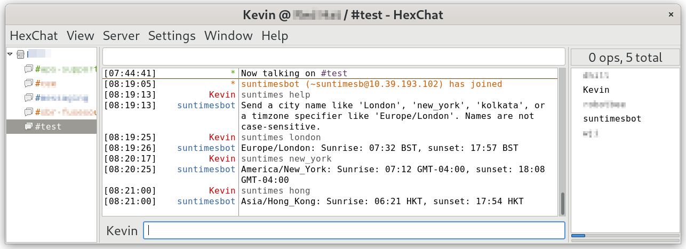

# quarkus-ircbot
 
Version 1.0.0
Kevin Boone, October 2022

## What is this?

`quarkus-ircbot` is a simple demonstration of how Apache Camel can
be used to create an IRC 'bot', which examines, and may respond to,
text sent to an IRC server. The application is based on the 
Quarkus framework and Camel extensions for Quarkus. 

The bot responds with sunrise and sunset times for a specific
city or timezone name, but the actual application is not of much
interest -- this example provides a framework for an IRC bot which
could be adapted for other, more useful, applications.

Camel makes this kind of application easy to implement: leaving aside
the mathematics of calculating the sunrise and sunset times, the
whole application comprises about a hundred lines of Java.

## Bot interaction

The bot can subscribe to selected IRC channels on a particular server,
but is not required to. If no channels are subscribed, the only way for
users to interact with it is to send it personal messages. For example

    /msg suntimesbot london

Otherwise, it looks for the keyword `suntimes` at the start of any
message to any channel which it is monitoring, and responds accordingly.

The keyword `suntimes` must be followed by the name of a city, or a
Unix-style timezone designator ("Europe/London"), or the word
"help". 

Here is an example of the bot in use, with the Hexchat IRC client.

## Prerequisites

- Java JDK 11 or later
- Maven version 3.2.8 or later
- GraalVM with native compilation extension installed, to test the native-code compilation support

## Configuration

All configuration parameters are in `src/resources/application.properties`.

All the application-specific settings
can be over-ridden at run time using environment variables.
Particularly relevant are the following settings:

`irc.proto`, `IRC_PROTO` -- the server protocol, which can be `irc` or `ircs`
for servers that require TLS.

`irc.mynick`, `IRC_MYNICK` -- the IRC nickname that the bot will use on
the IRC server.

`irc.server`, `IRC_SERVER` -- the IRC server hostname.

`irc.port`, `IRC_PORT` -- the IRC server port (usually 6667)

`irc.channels`, `IRC_CHANNELS` -- a comma-separated list of channels which
the bot should join.

`irc.mykey`, `IRC_MYKEY` -- the keyword which the bot will take to 
indicate that a message if for its attention. This could be empty if
the bot is not subscribing to any channels, as it will only respond
to direct messages.

## Building

    $ mvn clean package

This will build a "fat" JAR containing the application and all its
dependencies. 

## Running

To run the self-contained JAR: 

   java -jar target/quarkus-ircbot-1.0.0-runner.jar 

To run in development mode, use:

    mvn quarkus:dev

A useful feature of development mode, apart from enabling remote debugging,
is that allows the log level to be changed using a keypress. It also enables
dynamic reloading, so changing a source file will cause the service to be
rebuilt and restarted automatically. This is often quicker than running `mvn
package` repeatedly.

## Native compilation

If GraalVM, or an equivalent, is installed, this application can be compiled
to a native executable, and will run without a JVM. Alternatively, if you
have Docker or Podman, enable container builds, to run GraalVM in a container
(see "OpenShift" section below).

For local GraalVM builds, the Quarkus maintainers
now recommend Mandrel for compiling Quarkus to native code:
https://github.com/graalvm/mandrel/releases.

To build the native executable it should only be necessary to use the
`-Pnative` profile with Maven:

	GRAALVM_HOME=/path/to/graalvm mvn clean package -Pnative

This compilation process takes a long time for such a small program: 
minutes to tens of minutes. 

The size of the compiled executable is about 50Mb. It starts immediately
-- for all practical purposes -- although it still takes a few seconds
to initialize and connect to the IRC server.

## Notes

_City names_. It is a limitation of this application -- but not of the
IRC bot framework itself -- that there's no way for a user to get a
list of city names that the bot supports. Of course, such 
documentation could be provided. The city list depends on the JVM and
the platform on which the application was compiled, which makes it
a little tricky. It would be easy to modify the application so that
a particular keyword would dump the city list to the IRC channel --
but the list would be very long. Note that city names that contain
spaces, like New York, have to be entered as 'New\_York'. I don't
want to dwell on these points, because this isn't supposed to be a
production-quality application. 

_Native compilation_. The IRC extension for Camel is not routinely
tested in native mode, and you'll see a warning to that effect when
compiling. However, it seems to work fine in my tests.

_TLS support_. Camel supports IRC over TLS and, in simple cases,
it should be necessary only to change `irc.proto` to `ircs` and set
the appropriate port number. However, some servers will require more,
particularly if the server has to authenticate the client's certificate.
The application currently does not cater for these complexities, and
it may be necessary to change the Camel IRC endpoint definitions in
`MyRouteBuilder.java`.

_IRC authentication_. he application will not handle 
authenticated IRC servers, or authenticated access to channels. 
The Camel IRC framework can support this kind of operation but,
again, some code changes will be necessary. 

